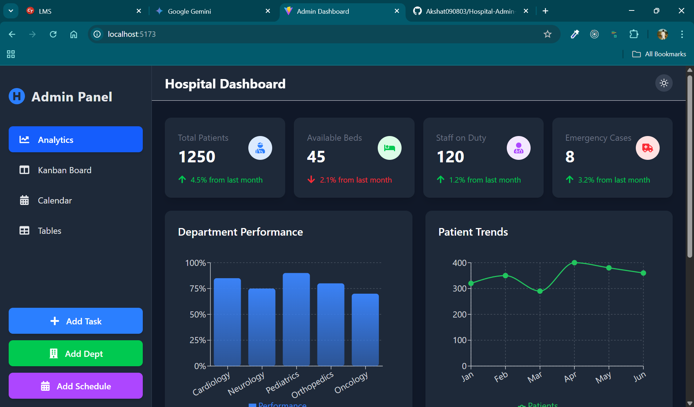
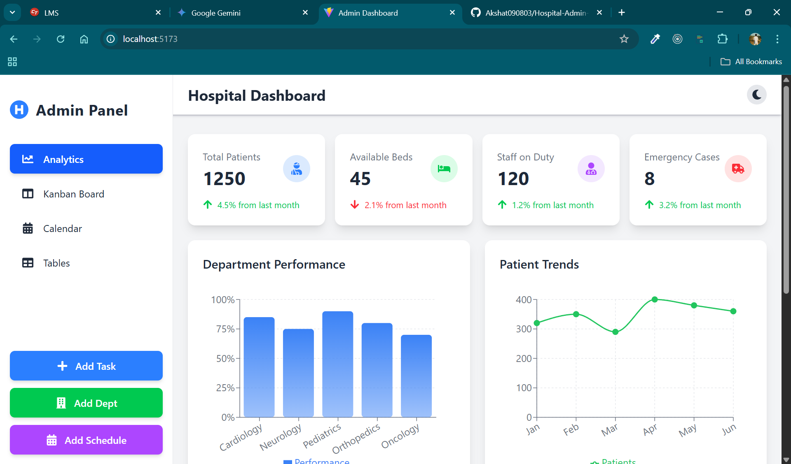
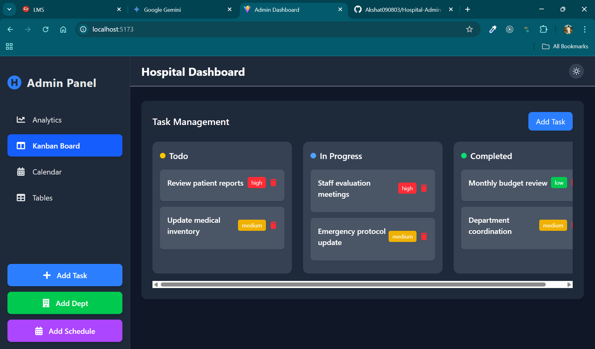
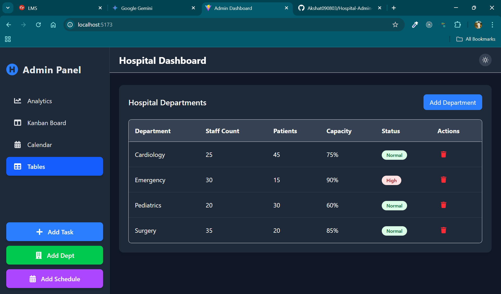
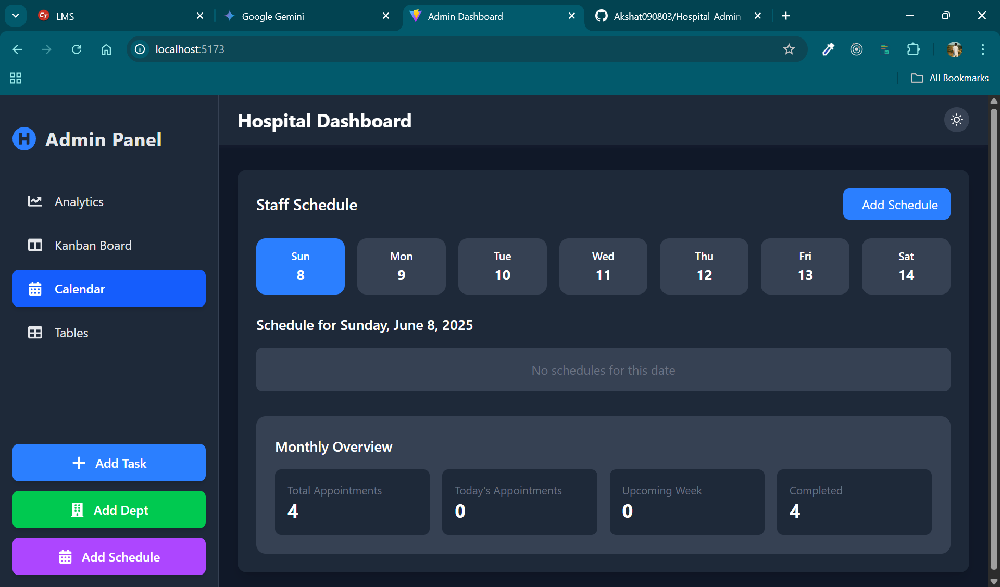

# 🏥 Hospital Administration Dashboard

## Overview

This **React.js and Tailwind CSS Hospital Dashboard** centralizes healthcare operations, offering **Recharts-powered analytics** for performance and patient trends. It includes a **Kanban board for task management**, a **calendar for scheduling**, and quick actions to add tasks, departments, or schedules, all while supporting a **dark mode**.

---

## Features

* **Dynamic Analytics & Visualizations**:
    * **Department Performance**: Bar charts with custom rounded edges and gradient fills.
    * **Patient Trends**: Line chart visualizing patient admissions over time.
    * **Bed Occupancy**: Pie chart showing occupied vs. available beds with optimized labels.
    * **Daily Admissions**: Bar chart for quick daily intake overview.
    * All charts are **responsive**, interactive with **tooltips**, and adapt to dark mode.
* **Key Hospital Statistics**: At-a-glance cards with essential numbers like total patients, available beds, staff on duty, and emergency cases, including **trend indicators**.
* **Adaptive Dark Mode**: Seamlessly switch between light and dark themes for comfortable viewing.
* **Intuitive Navigation**: A clean, enhanced sidebar for easy access to different sections.
* **Streamlined Operational Management**:
    * **Kanban Board**: Organize and track tasks efficiently through various stages.
    * **Calendar & Scheduling**: View and manage staff schedules and appointments.
    * **Quick Add Modals**: Quickly add new tasks, departments, or schedules directly from the sidebar.
    * **Departmental Tables**: Manage and review detailed hospital department information.

---

## Technologies Used

* **React.js**: Front-end JavaScript library for building user interfaces (bootstrapped with Vite).
* **Vite**: Fast development build tool for modern web projects.
* **Tailwind CSS**: Utility-first CSS framework for rapid UI development.
* **Recharts**: Composable charting library built on React components.
* **React Icons**: Popular icon library for scalable vector icons.

---

## Installation & Setup

Follow these steps to get the project up and running on your local machine.

1.  **Clone the repository:**
    ```bash
    git clone https://github.com/Akshat090803/Hospital-Admin-Dashboard.git
    ```

2.  **Navigate into the project directory:**
    ```bash
    cd Hospital-Admin-Dashboard
    ```

3.  **Install dependencies:**
    ```bash
    npm install
    # or
    yarn install
    ```

4.  **Start the development server:**
    ```bash
    npm run dev
    # or
    yarn dev
    ```
    The application will typically open in your browser at `http://localhost:5173` (or another port if 5173 is in use).

---

## Usage

Once the application is running, you can:

* Navigate between `Analytics`, `Kanban Board`, `Calendar`, and `Tables` using the sidebar.
* Toggle between light and dark mode using the switch in the header.
* Use the "Add Task", "Add Dept", and "Add Schedule" buttons in the sidebar to add new entries.
* Explore interactive charts in the Analytics section by hovering over elements.

---

## Screenshots

Here are some glimpses of the dashboard in action:

### Dark Theme Analytics View


### Light Theme Analytics View


### Kanban Board


### Departments Table


### Staff Schedule


---

## Contributing

Contributions are welcome! Please feel free to open issues or submit pull requests.
